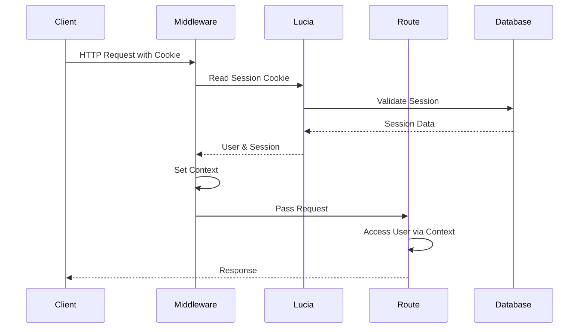

# Authentication Context and Middleware Architecture

## Overview

In BetterNews, user authentication state is made available throughout the application using Hono's context system combined with middleware. This architecture ensures that authenticated user information is accessible in all route handlers while maintaining type safety and separation of concerns.

## Context Type Definition

First, let's look at how the context type is defined:

```typescript
// context.ts
import type { Env } from "hono";
import type { Session, User } from "lucia";

export interface Context extends Env {
  Variables: {
    user: User | null;    // Can be null when there's no session
    session: Session | null;  // Can be null when there's no valid session
  };
}
```

This type definition establishes that our application's context can store both user and session information. The nullable types indicate that these values might not always be present, which is important for handling unauthenticated requests.

## Global Authentication Middleware

The magic happens in the main application setup where a global middleware processes every request:

```typescript
// index.ts
const app = new Hono<Context>();

app.use("*", cors(), async (c, next) => {
  // 1. Extract session ID from cookies
  const sessionId = lucia.readSessionCookie(c.req.header("Cookie") ?? "");
  
  if (!sessionId) {
    // 2a. No session cookie found - set null values
    c.set("user", null);
    c.set("session", null);
    return next();
  }

  // 2b. Validate session and get user information
  const { session, user } = await lucia.validateSession(sessionId);

  // 3. Handle session refresh if needed
  if (session && session.fresh) {
    c.header("Set-Cookie", lucia.createSessionCookie(session.id).serialize(), {
      append: true,
    });
  }

  // 4. Handle invalid sessions
  if (!session) {
    c.header("Set-Cookie", lucia.createBlankSessionCookie().serialize(), {
      append: true,
    });
  }

  // 5. Set user and session in context
  c.set("session", session);
  c.set("user", user);
  
  return next();
});
```

Let's break down how this works step by step:

### 1. Request Flow



### 2. Key Components

1. **Cookie Processing**:
   ```typescript
   const sessionId = lucia.readSessionCookie(c.req.header("Cookie") ?? "");
   ```
    - Extracts session ID from request cookies
    - Uses Lucia's built-in cookie parsing

2. **Session Validation**:
   ```typescript
   const { session, user } = await lucia.validateSession(sessionId);
   ```
    - Validates session against the database
    - Returns both session and user information if valid

3. **Context Setting**:
   ```typescript
   c.set("session", session);
   c.set("user", user);
   ```
    - Makes authentication data available to all downstream handlers
    - Type-safe thanks to the Context interface

### 3. Using Context in Routes

Routes can access the user information in a type-safe way:

```typescript
// posts.ts
app.post("/", loggedIn, async (c) => {
  // TypeScript knows user is not null due to loggedIn middleware
  const user = c.get("user")!;
  
  // Use user information
  const post = await db.insert(postsTable).values({
    userId: user.id,
    // ... other post data
  });
});
```

### 4. Protected Routes with Middleware

The `loggedIn` middleware ensures routes are only accessible to authenticated users:

```typescript
// middleware/loggedIn.ts
export const loggedIn = createMiddleware<Context>(async (c, next) => {
  const user = c.get("user");
  
  if (!user) {
    throw new HTTPException(401, { message: "Unauthorized" });
  }
  
  await next();
});
```

### 5. Type Safety and Error Handling

The system provides compile-time type safety:

```typescript
// Example of type safety in action
app.get("/profile", loggedIn, async (c) => {
  const user = c.get("user");
  
  // TypeScript knows user is not null after loggedIn middleware
  // So this is safe without additional checks
  return c.json({
    username: user.username,
    id: user.id
  });
});
```

## Benefits of This Architecture

1. **Centralized Authentication Logic**:
    - All authentication handling occurs in one place
    - Consistent across the entire application
    - Easy to modify authentication behavior

2. **Type Safety**:
    - TypeScript ensures correct usage of user data
    - Prevents accidental access of user data when it might be null
    - IDE autocompletion support

3. **Performance**:
    - Session validation happens once per request
    - Results are cached in the request context
    - Prevents multiple database lookups

4. **Flexibility**:
    - Easy to add additional context data
    - Simple to modify authentication logic
    - Supports different authentication strategies

## Common Patterns

### 1. Accessing User in Routes

```typescript
// Correct way to access user in protected routes
app.get("/protected", loggedIn, async (c) => {
  const user = c.get("user")!; // Safe to use ! here
  return c.json({ message: `Hello ${user.username}` });
});

// Handling optional authentication
app.get("/public", async (c) => {
  const user = c.get("user");
  return c.json({ 
    message: user ? `Hello ${user.username}` : "Hello guest" 
  });
});
```

### 2. Adding Custom Context Data

```typescript
// Extending context with additional data
interface CustomContext extends Context {
  Variables: {
    user: User | null;
    session: Session | null;
    preferences: UserPreferences | null;
  };
}

// Using custom middleware to add data
const withPreferences = createMiddleware<CustomContext>(async (c, next) => {
  const user = c.get("user");
  if (user) {
    const preferences = await getUserPreferences(user.id);
    c.set("preferences", preferences);
  }
  await next();
});
```

## Best Practices

1. **Always Use Type Safety**:
    - Leverage TypeScript's type system
    - Define proper interfaces for context data
    - Use the loggedIn middleware for protected routes

2. **Error Handling**:
    - Handle authentication errors gracefully
    - Provide clear error messages
    - Use proper HTTP status codes

3. **Session Management**:
    - Implement proper session cleanup
    - Handle session expiration
    - Refresh sessions when appropriate

4. **Security Considerations**:
    - Always validate session data
    - Implement proper CSRF protection
    - Use secure cookies in production

This architecture provides a robust foundation for handling authentication state throughout your application while maintaining type safety and separation of concerns. The context system makes it easy to access user information where needed while the middleware system ensures proper authentication checks are performed.