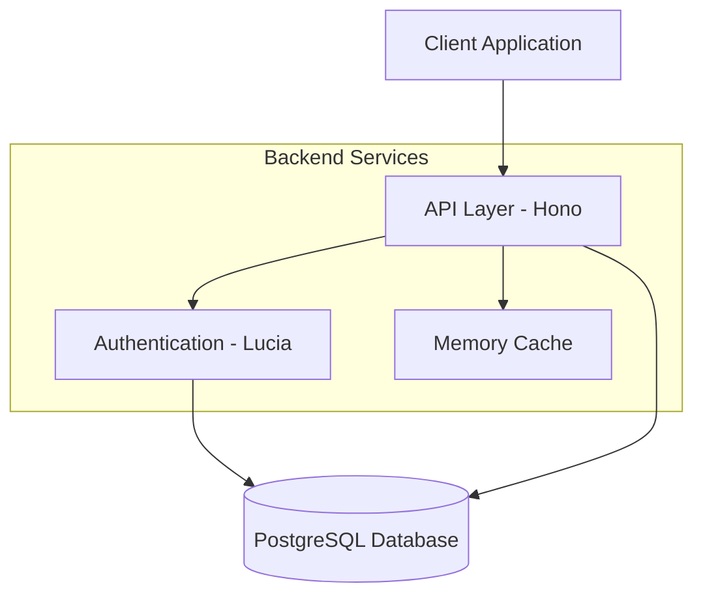
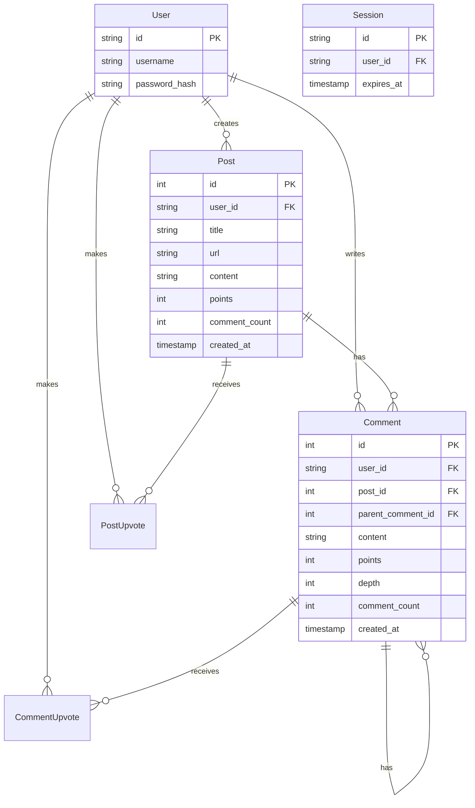

# BetterNews: Technical Documentation

## Table of Contents
1. [System Overview](#system-overview)
2. [Architecture](#architecture)
3. [Database Design](#database-design)
4. [Authentication & Authorization](#authentication--authorization)
5. [API Design](#api-design)
6. [Performance Considerations](#performance-considerations)
7. [Security Considerations](#security-considerations)
8. [Areas for Improvement](#areas-for-improvement)

## System Overview

BetterNews is a news aggregation and discussion platform built with modern web technologies. The system allows users to share, discuss, and vote on news articles and other content, similar to platforms like Hacker News or Reddit.

### Key Features
- User authentication and session management
- Post creation and management
- Nested comment system with unlimited depth
- Voting system for both posts and comments
- Pagination and sorting capabilities
- Real-time updates through modern APIs

### Tech Stack
- **Runtime**: Bun.js
- **Framework**: Hono
- **Database**: PostgreSQL
- **ORM**: DrizzleORM
- **Authentication**: Lucia
- **API Testing**: Bruno
- **Container Management**: Orbstack

## Architecture

### System Architecture Diagram


### Component Breakdown

#### API Layer (Hono Framework)
The application uses Hono for its API layer, providing:
- Route management
- Middleware support
- Type-safe request/response handling
- Error boundary management

```typescript
// Core application setup (index.ts)
const app = new Hono<Context>();

app.use("*", cors(), async (c, next) => {
  const sessionId = lucia.readSessionCookie(c.req.header("Cookie") ?? "");
  // Session validation logic
});

// Route registration
app.basePath("/api")
   .route("/auth", authRouter)
   .route("/posts", postsRouter)
   .route("/comments", commentsRouter);
```

#### Authentication Layer (Lucia)
Lucia handles all authentication-related functionality:
- Session management
- Password hashing
- Cookie handling
- User authentication state

```typescript
// Lucia configuration (lucia.ts)
export const lucia = new Lucia(adapter, {
  sessionCookie: {
    attributes: {
      secure: process.env.NODE_ENV === "production",
    },
  },
  getUserAttributes: (att) => ({
    username: att.username
  })
});
```

## Database Design

### Entity Relationship Diagram


### Table Relationships
The database schema implements complex relationships:

1. **User Relationships**:
    - One-to-many with Posts (author)
    - One-to-many with Comments (author)
    - One-to-many with PostUpvotes
    - One-to-many with CommentUpvotes

2. **Post Relationships**:
    - Many-to-one with User (author)
    - One-to-many with Comments
    - One-to-many with PostUpvotes

3. **Comment Relationships**:
    - Many-to-one with User (author)
    - Many-to-one with Post
    - Self-referential for nested comments
    - One-to-many with CommentUpvotes

### Schema Implementation
The schema is implemented using DrizzleORM with PostgreSQL:

```typescript
// Example of Post table schema
export const postsTable = pgTable("posts", {
  id: serial("id").primaryKey(),
  userId: text("user_id").notNull(),
  title: text("title").notNull(),
  url: text("url"),
  content: text("content"),
  points: integer("points").default(0).notNull(),
  commentCount: integer("comment_count").default(0).notNull(),
  createdAt: timestamp("created_at", {
    withTimezone: true,
  }).defaultNow().notNull(),
});
```

## Authentication & Authorization

### Authentication Flow
1. **Registration**:
   ```typescript
   // Registration process
   const passwordHash = await Bun.password.hash(password);
   const userId = generateId(15);
   await db.insert(userTable).values({
     id: userId,
     username,
     password_hash: passwordHash,
   });
   ```

2. **Login**:
   ```typescript
   // Login process
   const validPassword = await Bun.password.verify(
     password,
     existingUser.password_hash,
   );
   const session = await lucia.createSession(existingUser.id, { username });
   ```

3. **Session Management**:
   ```typescript
   // Session validation middleware
   const sessionId = lucia.readSessionCookie(c.req.header("Cookie") ?? "");
   const { session, user } = await lucia.validateSession(sessionId);
   ```

### Authorization
The system implements route-level authorization using middleware:

```typescript
export const loggedIn = createMiddleware<Context>(async (c, next) => {
  const user = c.get("user");
  if (!user) {
    throw new HTTPException(401, { message: "Unauthorized" });
  }
  await next();
});
```

## API Design

### RESTful Endpoints

1. **Authentication Routes** (`/api/auth`):
    - POST `/signup` - User registration
    - POST `/login` - User authentication
    - GET `/logout` - Session termination
    - GET `/user` - Current user information

2. **Posts Routes** (`/api/posts`):
    - GET `/` - List posts with pagination
    - POST `/` - Create new post
    - GET `/:id` - Get single post
    - POST `/:id/upvote` - Vote on post
    - POST `/:id/comment` - Comment on post
    - GET `/:id/comments` - Get post comments

3. **Comments Routes** (`/api/comments`):
    - POST `/:id` - Reply to comment
    - POST `/:id/upvote` - Vote on comment
    - GET `/:id/comments` - Get nested comments

### Response Format
All API responses follow a consistent format:

```typescript
type SuccessResponse<T = void> = {
  success: true;
  message: string;
  data?: T;
};

type ErrorResponse = {
  success: false;
  error: string;
  isFormError?: boolean;
};
```

## Performance Considerations

### Database Optimizations

1. **Indexing Strategy**:
    - Primary keys on all tables
    - Foreign key indexes for relationships
    - Composite indexes for common queries

2. **Query Optimization**:
   ```typescript
   // Example of optimized query with joins
   const postsQuery = db
     .select({
       id: postsTable.id,
       title: postsTable.title,
       author: {
         username: userTable.username,
         id: userTable.id,
       }
     })
     .from(postsTable)
     .leftJoin(userTable, eq(postsTable.userId, userTable.id));
   ```

3. **Pagination Implementation**:
   ```typescript
   const offset = (page - 1) * limit;
   const query = db.select()
     .from(postsTable)
     .limit(limit)
     .offset(offset);
   ```

### Caching Opportunities
The current implementation lacks caching. Potential improvements:

1. **Result Caching**:
    - Cache frequently accessed posts
    - Cache user data
    - Cache comment trees

2. **Session Caching**:
    - Implement Redis for session storage
    - Cache user permissions

## Security Considerations

### Current Security Measures

1. **Password Security**:
    - Passwords are hashed using Bun's built-in password hashing
    - Salt is automatically handled

2. **Session Security**:
    - Secure session cookies in production
    - Session expiration handling
    - Session invalidation on logout

3. **Input Validation**:
   ```typescript
   // Example of input validation using Zod
   export const loginSchema = z.object({
     username: z
       .string()
       .min(3)
       .max(31)
       .regex(/^[a-zA-Z0-9_]+$/),
     password: z.string().min(3).max(255),
   });
   ```

### Security Recommendations

1. **Rate Limiting**:
    - Implement rate limiting for API endpoints
    - Add specific limits for authentication endpoints

2. **CORS Policy**:
    - Review and tighten CORS configuration
    - Implement proper origin validation

3. **Content Security**:
    - Implement content validation
    - Add XSS protection
    - Sanitize user input

## Areas for Improvement

### Technical Improvements

1. **Caching Layer**:
    - Implement Redis for caching
    - Add cache invalidation strategy
    - Cache frequently accessed data

2. **API Enhancements**:
    - Add rate limiting
    - Implement proper pagination headers
    - Add API versioning

3. **Database Optimizations**:
    - Add database indexes
    - Implement connection pooling
    - Add query optimization

### Feature Additions

1. **User Features**:
    - User profiles
    - Password reset functionality
    - Email verification
    - OAuth integration

2. **Content Features**:
    - Rich text editing
    - Image uploads
    - Tag system
    - Search functionality

3. **Administrative Features**:
    - Moderation tools
    - User management
    - Content moderation
    - Analytics dashboard