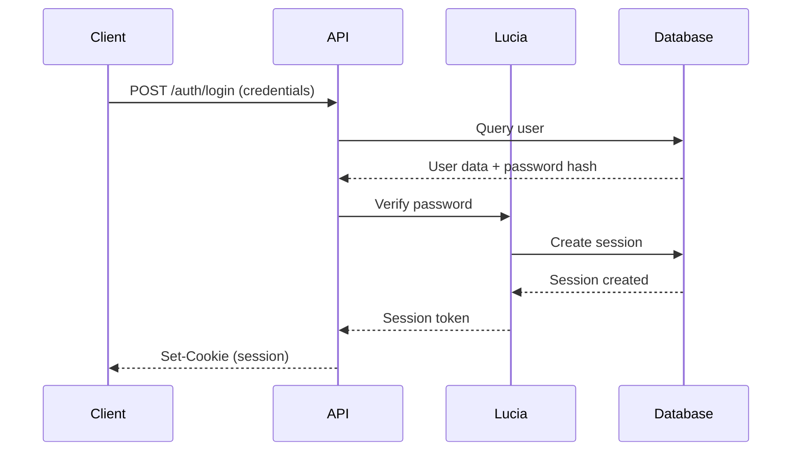

# BetterNews: Technical Deep Dive

## Authentication Flow and Security Measures

### Session-Based Authentication Architecture

The authentication system in BetterNews uses Lucia combined with PostgreSQL for session management. This provides a robust, stateful authentication system that's more secure than token-based authentication for this use case. Here's how it works:



Let's examine each component:

1. **Password Handling**:
```typescript
// In auth.ts
const passwordHash = await Bun.password.hash(password);
// Later...
const validPassword = await Bun.password.verify(
  password,
  existingUser.password_hash
);
```
This uses Bun's built-in password hashing which implements the Argon2 algorithm - chosen for its memory-hardness and resistance to GPU-based attacks.

2. **Session Management**:
```typescript
// Session creation during login
const session = await lucia.createSession(userId, { 
  username // Attributes stored in session
});

// Session validation middleware
export const loggedIn = createMiddleware<Context>(async (c, next) => {
  const user = c.get("user");
  if (!user) {
    throw new HTTPException(401, { message: "Unauthorized" });
  }
  await next();
});
```

3. **Security Headers**:
   The application should implement security headers. Here's a recommended addition:

```typescript
app.use("*", async (c, next) => {
  // Security headers
  c.header("X-Content-Type-Options", "nosniff");
  c.header("X-Frame-Options", "DENY");
  c.header("Content-Security-Policy", "default-src 'self'");
  c.header("X-XSS-Protection", "1; mode=block");
  await next();
});
```

### Advanced Security Considerations

1. **Rate Limiting Implementation**:
```typescript
const rateLimit = new Map<string, number>();

const rateLimitMiddleware = createMiddleware<Context>(async (c, next) => {
  const ip = c.req.header("x-forwarded-for") || "unknown";
  const now = Date.now();
  const windowStart = now - 60000; // 1 minute window
  
  // Clean old entries
  for (const [key, timestamp] of rateLimit.entries()) {
    if (timestamp < windowStart) rateLimit.delete(key);
  }
  
  // Check rate limit
  const requestCount = Array.from(rateLimit.values())
    .filter(timestamp => timestamp > windowStart)
    .length;
    
  if (requestCount > 100) { // 100 requests per minute
    throw new HTTPException(429, { 
      message: "Too many requests" 
    });
  }
  
  rateLimit.set(`${ip}-${now}`, now);
  await next();
});
```

2. **CSRF Protection**:
```typescript
const csrfProtection = createMiddleware<Context>(async (c, next) => {
  const method = c.req.method;
  if (method !== "GET" && method !== "HEAD") {
    const csrfToken = c.req.header("X-CSRF-Token");
    if (!csrfToken || !validateCsrfToken(csrfToken)) {
      throw new HTTPException(403, { 
        message: "Invalid CSRF token" 
      });
    }
  }
  await next();
});
```

## Database Optimization Strategies

### Query Optimization

1. **Efficient Joins and Selections**:
```typescript
// Optimized post query with selective joins
const getPost = async (postId: number, userId?: string) => {
  const query = db
    .select({
      id: postsTable.id,
      title: postsTable.title,
      content: postsTable.content,
      author: {
        // Only select needed user fields
        username: userTable.username,
        id: userTable.id
      },
      // Conditional upvote status
      isUpvoted: userId 
        ? sql<boolean>`EXISTS (
            SELECT 1 FROM ${postUpvotesTable}
            WHERE post_id = ${postId}
            AND user_id = ${userId}
          )`
        : sql<boolean>`false`
    })
    .from(postsTable)
    .leftJoin(userTable, eq(postsTable.userId, userTable.id))
    .where(eq(postsTable.id, postId));

  const [post] = await query;
  return post;
};
```

2. **Pagination with Cursor-Based Implementation**:
```typescript
interface PaginationParams {
  cursor?: number;
  limit: number;
  sortBy: 'recent' | 'points';
}

const getPosts = async ({ cursor, limit, sortBy }: PaginationParams) => {
  const sortColumn = sortBy === 'recent' 
    ? postsTable.createdAt 
    : postsTable.points;

  const query = db
    .select()
    .from(postsTable)
    .limit(limit + 1) // Get one extra to check for next page
    .orderBy(desc(sortColumn));

  if (cursor) {
    query.where(
      sortBy === 'recent'
        ? lt(postsTable.createdAt, new Date(cursor))
        : lt(postsTable.points, cursor)
    );
  }

  const posts = await query;
  const hasNextPage = posts.length > limit;
  const nextCursor = hasNextPage 
    ? sortBy === 'recent'
      ? posts[posts.length - 2].createdAt.getTime()
      : posts[posts.length - 2].points
    : null;

  return {
    posts: posts.slice(0, limit),
    pagination: {
      hasNextPage,
      nextCursor
    }
  };
};
```

3. **Composite Indexes for Common Queries**:
```typescript
// In migration or schema file
createIndex('posts_user_created', {
  table: 'posts',
  columns: ['user_id', 'created_at'],
  unique: false
});

createIndex('comments_post_points', {
  table: 'comments',
  columns: ['post_id', 'points'],
  unique: false
});
```

### Transaction Management

Complex operations should use transactions to maintain data consistency:

```typescript
const createComment = async (postId: number, userId: string, content: string) => {
  return await db.transaction(async (tx) => {
    // Create comment
    const [comment] = await tx
      .insert(commentsTable)
      .values({
        postId,
        userId,
        content
      })
      .returning();

    // Update post comment count
    await tx
      .update(postsTable)
      .set({
        commentCount: sql`${postsTable.commentCount} + 1`
      })
      .where(eq(postsTable.id, postId));

    return comment;
  });
};
```

## API Design Patterns and Best Practices

### RESTful Resource Modeling

The API follows REST principles with proper resource naming and HTTP method usage:

1. **Resource Collections and Items**:
```typescript
// Posts collection
app.get("/posts", async (c) => {
  // List posts
});

// Single post resource
app.get("/posts/:id", async (c) => {
  // Get single post
});

// Related resources
app.get("/posts/:id/comments", async (c) => {
  // Get comments for post
});

// Actions on resources
app.post("/posts/:id/upvote", async (c) => {
  // Upvote post
});
```

2. **Query Parameter Handling**:
```typescript
const paginationSchema = z.object({
  limit: z.number().min(1).max(100).default(20),
  page: z.number().min(1).default(1),
  sortBy: z.enum(['recent', 'points']).default('recent'),
  order: z.enum(['asc', 'desc']).default('desc')
});

app.get("/posts", zValidator("query", paginationSchema), async (c) => {
  const { limit, page, sortBy, order } = c.req.valid("query");
  // Handle query
});
```

3. **Error Response Standardization**:
```typescript
type APIError = {
  code: string;
  message: string;
  details?: Record<string, unknown>;
};

const createAPIError = (
  code: string,
  message: string,
  details?: Record<string, unknown>
): APIError => ({
  code,
  message,
  details
});

app.onError((err, c) => {
  if (err instanceof HTTPException) {
    return c.json({
      error: createAPIError(
        err.status.toString(),
        err.message,
        err.cause as Record<string, unknown>
      )
    }, err.status);
  }
  
  // Log unexpected errors
  console.error(err);
  
  return c.json({
    error: createAPIError(
      'INTERNAL_ERROR',
      'An unexpected error occurred'
    )
  }, 500);
});
```

### Response Envelope Pattern

All responses follow a consistent envelope pattern:

```typescript
interface ResponseEnvelope<T> {
  success: boolean;
  data?: T;
  error?: APIError;
  meta?: {
    pagination?: {
      currentPage: number;
      totalPages: number;
      totalItems: number;
      hasNextPage: boolean;
      hasPreviousPage: boolean;
    };
    timestamp: string;
    version: string;
  };
}

const createResponse = <T>(data: T, meta?: ResponseEnvelope<T>['meta']): ResponseEnvelope<T> => ({
  success: true,
  data,
  meta: {
    ...meta,
    timestamp: new Date().toISOString(),
    version: '1.0'
  }
});
```

## Development Workflow and Tooling

### Local Development Environment

1. **Development Container Setup**:
```yaml
# docker-compose.dev.yml
version: '3.8'
services:
  db:
    image: postgres:17
    environment:
      POSTGRES_USER: ${DB_USER}
      POSTGRES_PASSWORD: ${DB_PASSWORD}
      POSTGRES_DB: ${DB_NAME}
    ports:
      - "5432:5432"
    volumes:
      - postgres_data:/var/lib/postgresql/data
    healthcheck:
      test: ["CMD-SHELL", "pg_isready -U ${DB_USER}"]
      interval: 5s
      timeout: 5s
      retries: 5

volumes:
  postgres_data:
```

2. **Development Scripts**:
```json
{
  "scripts": {
    "dev": "bun run --hot server/index.ts",
    "db:studio": "bunx drizzle-kit studio",
    "db:push": "bunx drizzle-kit push",
    "db:generate": "bunx drizzle-kit generate:pg",
    "test": "bun test",
    "lint": "eslint . --ext .ts",
    "format": "prettier --write ."
  }
}
```

### Database Migration Workflow

1. **Schema Changes**:
```typescript
// Create a new migration
const createPostsTable = sql`
  CREATE TABLE posts (
    id SERIAL PRIMARY KEY,
    user_id TEXT NOT NULL REFERENCES users(id),
    title TEXT NOT NULL,
    content TEXT,
    points INTEGER NOT NULL DEFAULT 0,
    created_at TIMESTAMPTZ NOT NULL DEFAULT CURRENT_TIMESTAMP
  );
`;

const addPostIndexes = sql`
  CREATE INDEX posts_user_id_idx ON posts(user_id);
  CREATE INDEX posts_created_at_idx ON posts(created_at DESC);
`;
```

2. **Migration Runner**:
```typescript
import { drizzle } from 'drizzle-orm/postgres-js';
import { migrate } from 'drizzle-orm/postgres-js/migrator';

const runMigrations = async () => {
  const db = drizzle(postgres(process.env.DATABASE_URL!));
  
  console.log('Running migrations...');
  await migrate(db, {
    migrationsFolder: './drizzle'
  });
  console.log('Migrations completed');
};

runMigrations().catch(console.error);
```

## Performance Optimization Techniques

### Query Performance

1. **Batch Operations**:
```typescript
const batchUpdatePoints = async (postIds: number[]) => {
  await db.transaction(async (tx) => {
    await Promise.all(
      postIds.map(id =>
        tx
          .update(postsTable)
          .set({
            points: sql`${postsTable.points} + 1`
          })
          .where(eq(postsTable.id, id))
      )
    );
  });
};
```

2. **Selective Loading**:
```typescript
const getPostPreview = async (postId: number) => {
  const [post] = await db
    .select({
      id: postsTable.id,
      title: postsTable.title,
      // Only load excerpt of content
      excerpt: sql<string>`
        CASE 
          WHEN length(${postsTable.content}) > 200 
          THEN substr(${postsTable.content}, 1, 197) || '...'
          ELSE ${postsTable.content}
        END
      `
    })
    .from(postsTable)
    .where(eq(postsTable.id, postId));
    
  return post;
};
```

### Caching Strategy

Here's a recommended caching implementation using a simple in-memory cache:

```typescript
class Cache<T> {
  private cache: Map<string, { 
    value: T; 
    expires: number 
  }> = new Map();
  
  constructor(private ttl: number = 60000) {} // Default 1 minute TTL
  
  set(key: string, value: T): void {
    this.cache.set(key, {
      value,
      expires: Date.now() + this.ttl
    });
  }
  
  get(key: string): T | null {
    const item = this.cache.get(key);
    if (!item) return null;
    
    if (Date.now() > item.expires) {
      this.cache.delete(key);
      return null;
    }
    
    return item.value;
  }
  
  delete(key: string): void {
    this.cache.delete(key);
  }
  
  clear(): void {
    this.cache.clear();
  }
}

// Usage
const postCache = new Cache<Post>(5 * 60000); // 5 minutes TTL

const getPostWithCache = async (postId: number): Promise<Post> => {
  const cacheKey = `post:${postId}`;
  const cachedPost = postCache.get(cacheKey);
  
  if (cachedPost) {
    return cachedPost;
  }
  
  const post = await getPost(postId);
  postCache.set(cacheKey, post);
  return post;
};

// Implement cache invalidation on updates
const updatePost = async (postId: number, data: Partial<Post>): Promise<Post> => {
  const post = await db
    .update(postsTable)
    .set(data)
    .where(eq(postsTable.id, postId))
    .returning()
    .then(rows => rows[0]);

  // Invalidate cache after update
  postCache.delete(`post:${postId}`);
  return post;
};
```

### Connection Pooling

For better database performance, implement connection pooling:

```typescript
import postgres from 'postgres';

const pool = postgres(process.env.DATABASE_URL!, {
  max: 10, // maximum number of connections
  idle_timeout: 20, // close idle connections after 20 seconds
  connect_timeout: 10, // timeout connecting to database
  prepare: false, // disable prepared statements for better performance
});

const db = drizzle(pool);
```

### Query Optimization Techniques

1. **Compound Indexes for Common Queries**:
```typescript
// Create indexes for common query patterns
db.execute(sql`
  CREATE INDEX posts_user_created_idx ON posts (user_id, created_at DESC);
  CREATE INDEX comments_post_created_idx ON comments (post_id, created_at DESC);
  CREATE INDEX upvotes_post_user_idx ON post_upvotes (post_id, user_id);
`);
```

2. **Efficient Pagination with Keyset Pagination**:
```typescript
interface KeysetPaginationParams {
  lastId?: number;
  lastCreatedAt?: Date;
  limit: number;
}

const getPostsKeyset = async ({ 
  lastId, 
  lastCreatedAt, 
  limit 
}: KeysetPaginationParams) => {
  let query = db
    .select()
    .from(postsTable)
    .orderBy(desc(postsTable.createdAt))
    .limit(limit);

  if (lastId && lastCreatedAt) {
    query = query.where(
      or(
        lt(postsTable.createdAt, lastCreatedAt),
        and(
          eq(postsTable.createdAt, lastCreatedAt),
          lt(postsTable.id, lastId)
        )
      )
    );
  }

  return query;
};
```

3. **Optimizing Nested Comment Queries**:
```typescript
const getCommentTree = async (postId: number, depth: number = 3) => {
  // Use recursive CTE for efficient nested comment fetching
  const commentTree = await db.execute(sql`
    WITH RECURSIVE comment_tree AS (
      -- Base case: top-level comments
      SELECT 
        c.*,
        0 as level
      FROM comments c
      WHERE post_id = ${postId} 
      AND parent_comment_id IS NULL

      UNION ALL

      -- Recursive case: replies
      SELECT 
        c.*,
        ct.level + 1
      FROM comments c
      JOIN comment_tree ct ON c.parent_comment_id = ct.id
      WHERE ct.level < ${depth}
    )
    SELECT * FROM comment_tree
    ORDER BY level, created_at DESC;
  `);

  return commentTree;
};
```

### Memory Optimization

1. **Streaming Large Results**:
```typescript
const streamPosts = async function* () {
  const query = db
    .select()
    .from(postsTable)
    .orderBy(desc(postsTable.createdAt));

  // Use cursor-based iteration for memory efficiency
  for await (const post of query) {
    yield post;
  }
};

// Usage
app.get("/posts/export", async (c) => {
  c.header("Content-Type", "application/json");
  c.header("Transfer-Encoding", "chunked");
  
  const writer = c.res.getWriter();
  writer.write("[");
  
  let first = true;
  for await (const post of streamPosts()) {
    if (!first) writer.write(",");
    writer.write(JSON.stringify(post));
    first = false;
  }
  
  writer.write("]");
  writer.close();
});
```

2. **Batch Processing for Large Operations**:
```typescript
const batchProcessUsers = async (userIds: string[], batchSize: number = 100) => {
  for (let i = 0; i < userIds.length; i += batchSize) {
    const batch = userIds.slice(i, i + batchSize);
    await db.transaction(async (tx) => {
      await Promise.all(
        batch.map(userId => 
          tx.update(userTable)
            .set({ lastActive: new Date() })
            .where(eq(userTable.id, userId))
        )
      );
    });
  }
};
```

### Monitoring and Profiling

1. **Query Performance Monitoring**:
```typescript
const monitorQuery = async <T>(
  name: string, 
  queryFn: () => Promise<T>
): Promise<T> => {
  const start = process.hrtime();
  
  try {
    const result = await queryFn();
    const [seconds, nanoseconds] = process.hrtime(start);
    const duration = seconds * 1000 + nanoseconds / 1e6;
    
    console.log(`Query ${name} took ${duration.toFixed(2)}ms`);
    return result;
  } catch (error) {
    console.error(`Query ${name} failed:`, error);
    throw error;
  }
};

// Usage
const getPost = async (id: number) => {
  return monitorQuery(`getPost:${id}`, () =>
    db.select()
      .from(postsTable)
      .where(eq(postsTable.id, id))
      .limit(1)
  );
};
```

2. **Performance Metrics Collection**:
```typescript
interface QueryMetrics {
  name: string;
  duration: number;
  timestamp: Date;
  success: boolean;
}

class MetricsCollector {
  private metrics: QueryMetrics[] = [];
  
  record(metric: QueryMetrics) {
    this.metrics.push(metric);
    
    // Keep only last 1000 metrics
    if (this.metrics.length > 1000) {
      this.metrics = this.metrics.slice(-1000);
    }
  }
  
  getAverageQueryTime(queryName: string): number {
    const relevantMetrics = this.metrics
      .filter(m => m.name === queryName && m.success);
    
    if (relevantMetrics.length === 0) return 0;
    
    const total = relevantMetrics
      .reduce((sum, m) => sum + m.duration, 0);
    return total / relevantMetrics.length;
  }
}

const metrics = new MetricsCollector();

// Usage with query monitoring
const monitorQueryWithMetrics = async <T>(
  name: string, 
  queryFn: () => Promise<T>
): Promise<T> => {
  const start = process.hrtime();
  let success = false;
  
  try {
    const result = await queryFn();
    success = true;
    return result;
  } finally {
    const [seconds, nanoseconds] = process.hrtime(start);
    const duration = seconds * 1000 + nanoseconds / 1e6;
    
    metrics.record({
      name,
      duration,
      timestamp: new Date(),
      success
    });
  }
};
```